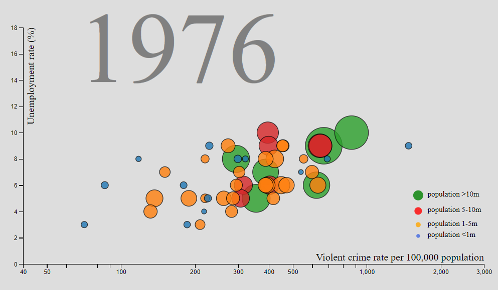
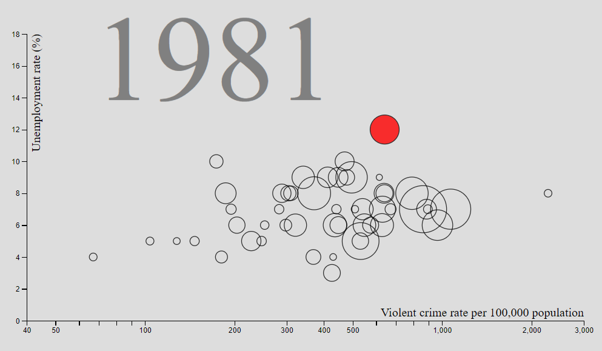
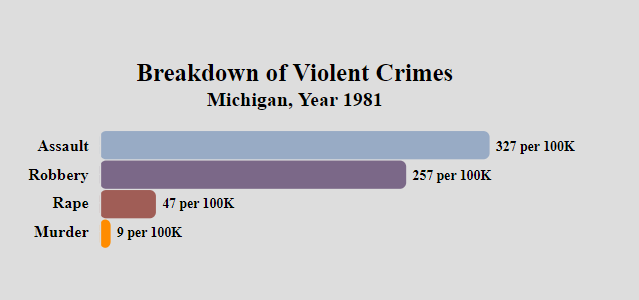
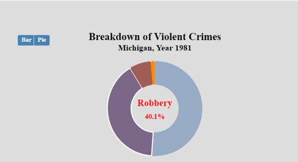
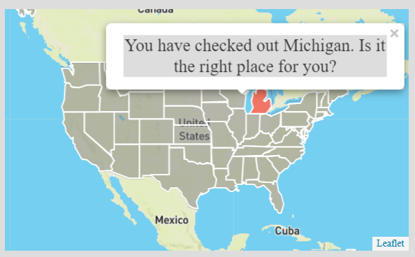
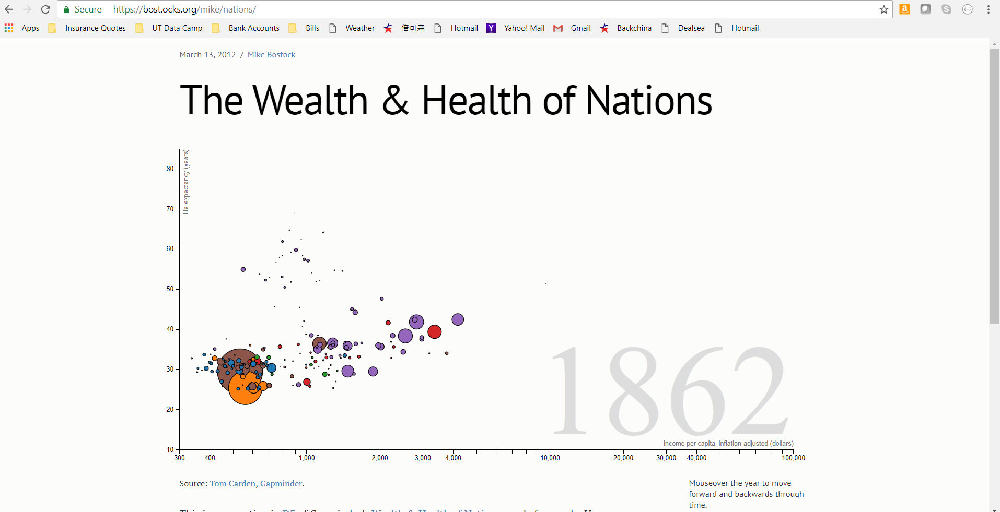
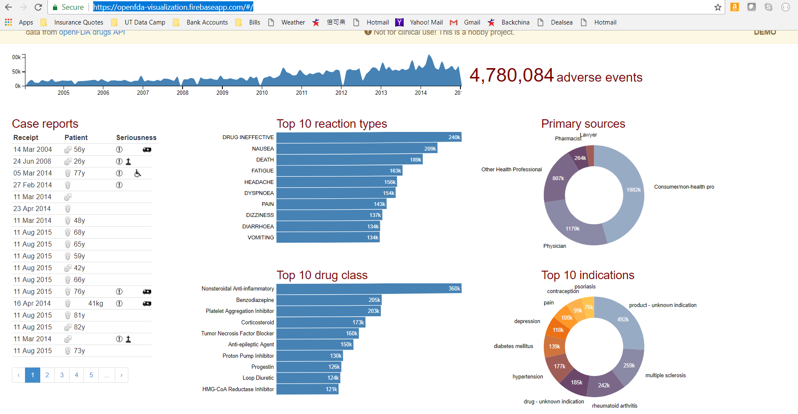

## Visualization of US Crime and Employment Statistics Over 40 Years

#### Team Members:
+ Aditi Sharma
+ Bill Wilson
+ Gayatri Pingale
+ Nelson Wang

#### Objectives:  
Created an interactive web page to visualize US crime and employment statistics over 40 years
+ Part I - An animated bubble chart that allows users explore 50 state data in 5 dimensions (unemployment rate, crime rate, population, classification of state, year) and trend over years:  
   
      
+ Part II - A bar chart and pie chart section that is triggered by a click on any bubble in part I.  Animated transitions from bar chart to pie chart, and vice versa, to show breakdown details of crime data of selected state and year.  
   

+ Part III - A US map that is triggered by a click on any bubble in part I.  Allow uses to zoom in/zoom out, navigate and and select different states on the map which interactive with charts in Part I and Part II.  

### Dataset

+ [Bureau of Labor Statistics](https://www.bls.gov/lau/rdscnp16.htm)
+ [Uniform Crime Reporting Statistics](https://www.bjs.gov/ucrdata/Search/Crime/State/StatebyState.cfm?NoVariables=Y&CFID=247193930&CFTOKEN=b6105fea0ed761eb-FDFE448E-D159-1EA8-A5EFE168BA588D99)

### Inspiring Visualizations

+ [The Wealth & Health of Nations](https://bost.ocks.org/mike/nations/)  

+ [Drug adverse events](https://openfda-visualization.firebaseapp.com/#/)  

### Sketch of Design:

+ In the left side (2/3 of page) create a scatter plot for state data over 50 years, allow animation with a play button (similar to the wealth & health chart)
+ In the right side (1/3 of page) create a bar chart or pie chart when the user click on any specific state for a particular year on the left chart.  Add animations and transitions similar to the drug adverse events chart
+ If time allows, add a US 50 state map on a seperate page.  When a user clicks on the bar chart or pie chart, it will redirect to the map page and highlight the state selected, and display some interesting information about the selected state.
